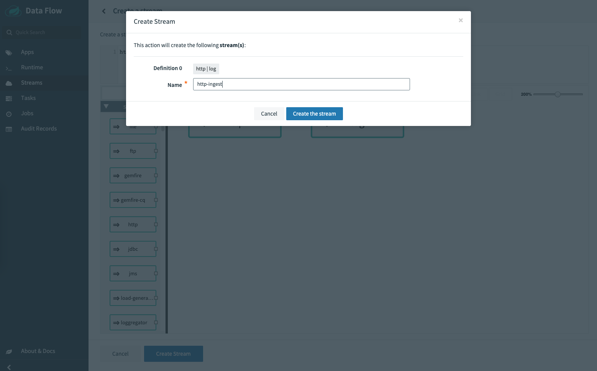
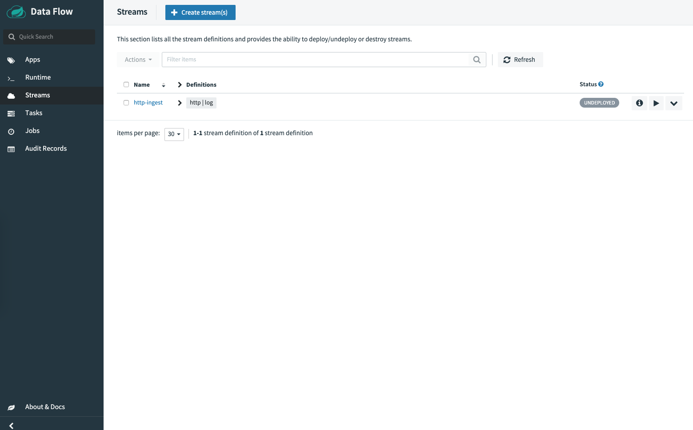
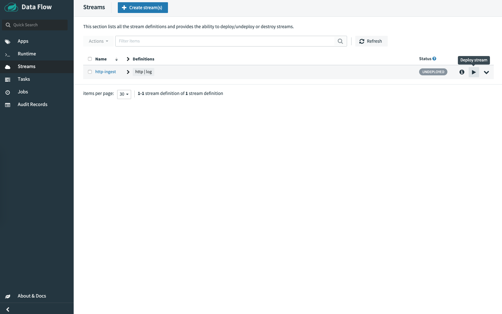
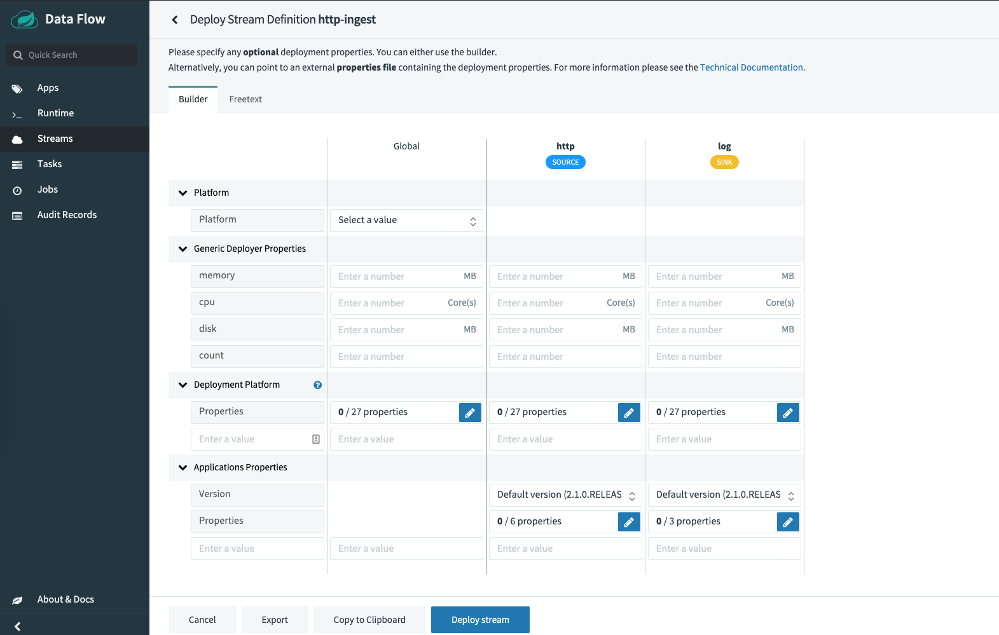
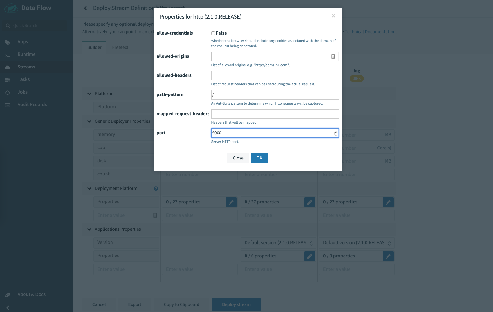

# Introduction

Spring Cloud Data Flow provides over >70 pre-built streaming applications that you can use right away to implement common streaming use cases.
In this guide we will use two of these applications to construct a simple data pipeline that produces data sent from an external http request and consumes that data by logging the payload to the terminal.

Instructions for registering these pre-built applications with Data Flow are provided in the [Installation guide](%currentPath%/installation/).

## Stream DSL overview

Streams can be created using a Domain Specific Language (DSL) using the Shell or the Dashboard as well as programmatically in Java.
The Dashboard also lets you drag and drop applications onto a palate, and connect them visually.
The Dashboard is bi-directional, so visual actions update the DSL and edits to the DSL update the view of the stream.

The DSL is modelled after the Unix pipes and filter syntax.
As an example, the stream DSL `http | log` represents `http` application sending the data it received from a HTTP post to the messaging middleware.  
The `log` application receives the message with that data from the messaging middleware and logs it to the terminal.
Each name in the DSL is associated with an application via the application registration process.
The applications are connected via a `|` symbol representing the messaging middleware that acts as the 'pipe' between the applications.

## Creating the Stream

To create a stream:

1.  In the menu, click **Streams**.

2.  Click the **Create Stream(s)** button.

    The screen changes to the following image:

    

3.  In the text area, type `http | log`.

4.  Click **Create Stream**.

5.  Enter `http-ingest` for the stream name, as shown in the following
    image:

    

6.  Click "Create the stream" button.

    The Definitions page appears.

    

## Deploying a Stream

Now that you have defined a stream, you can deploy it. To do so:

1.  Click the play (deploy) button next to the "`http-ingest`" definition
    that you created in the previous section.
    

    The UI shows the available properties that can be applied to the
    apps in the "`http-ingest`" stream. This example shown in the following
    image uses the defaults:

    

    If you are using the local Data Flow Server, add the following deployment property to set the port to avoid a port collision.

    

2.  Click the **Deploy Stream** button.

    The UI returns to the Definitions page.

    The stream is now in "`deploying`" status, and its status becomes
    "`deployed`" when it is finished deploying. You may need to refresh
    your browser to see the updated status.

## Verifying Output

### Local

#### Test Data

Once the stream is deployed and running, you can now post some data.

```bash
curl http://localhost:9000 -H "Content-type: text/plain" -d "Happy streaming"
```

#### Results

Once a stream is deployed, you can view its logs. To do so:

1.  Click **Runtime** in the menu.

2.  Click "`http-ingest.log`".

3.  Copy the path in the "`stdout`" text box on the dashboard

4.  In another console window, type the following, replacing
    `/path/from/stdout/textbox/in/dashboard` with the value you copied
    in the previous step:

        $ docker exec -it skipper tail -f /path/from/stdout/textbox/in/dashboard

    The output of the log sink appears in the new window. You will see output as shown below.
    When you have seen enough output from sending http requests, press Ctrl+C to end the `tail` command.

```bash
log-sink                                 : Happy streaming
```

### Cloud Foundry

#### Test Data

Once the stream is deployed and running in Cloud Foundry, you can now post some data.

```bash
curl http://http-ingest-314-log-v1.cfapps.io -H "Content-type: text/plain" -d "Happy streaming"
```

#### Results

Now you can list the running applications again and see your
applications in the list, as the following example shows:

    $ cf apps                                                                                                                                                                                                                                         [1h] ✭
    Getting apps in org ORG / space SPACE as email@pivotal.io...

    name                         requested state   instances   memory   disk   urls
    http-ingest-314-log-v1       started           1/1         1G       1G     http-ingest-314-log-v1.cfapps.io
    http-ingest-314-http-v1      started           1/1         1G       1G     http-ingest-314-http-v1.cfapps.io
    skipper-server               started           1/1         1G       1G     skipper-server.cfapps.io
    dataflow-server              started           1/1         1G       1G     dataflow-server.cfapps.io

Now you can verify the logs.

```bash
cf logs http-ingest-314-log-v1
...
...
2017-11-20T15:39:43.76-0800 [APP/PROC/WEB/0] OUT 2017-11-20 23:39:43.761  INFO 12 --- [ http-ingest-314.http.ticker-314-1] log-sink                                 : Happy streaming
```

### Kubernetes

#### Test Data

Once the stream is deployed and running in Kubernetes, you can now post some data.

```bash
curl http://<EXTERNAL_IP_OF_http-ingest-log-v1-0-2k4r8_SERVICE> -H "Content-type: text/plain" -d "Happy streaming"
```

#### Results

```bash
kubectl get pods
NAME                              READY     STATUS    RESTARTS   AGE
http-ingest-log-v1-0-2k4r8          1/1       Running   0          2m
http-ingest-http-v1-qhdqq           1/1       Running   0          2m
mysql-777890292-z0dsw               1/1       Running   0          49m
rabbitmq-317767540-2qzrr            1/1       Running   0          49m
scdf-server-2734071167-bjd3g        1/1       Running   0          12m
skipper-2408247821-50z31            1/1       Running   0          15m
```

Now you can verify the logs.

```bash
kubectl logs -f http-ingest-log-v1-0-2k4r8
...
...
2017-10-30 22:59:04.966  INFO 1 --- [ http-ingest.http.http-ingest-1] log-sink                                 : Happy streaming
```

## Deleting a Stream

Now you can delete the stream you created. To do so:

1.  Click **Streams** in the menu.

2.  Click the down chevron on the "`http-ingest`" row.

3.  Click the **Destroy Stream**.

4.  When prompted for confirmation, click **Destroy
    Stream Definition(s)**.

## Updating and Rolling back a Stream

This information can be found in the [Continuous Delivery](%currentPath%/stream-developer-guides/continuous-delivery) guide.

## Monitoring

This information can be found in the [Stream Monitoring](%currentPath%/feature-guides/streams/monitoring/) guide.
