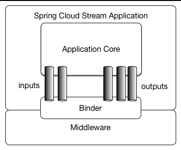

# Programming Model for Streaming Applications

Before we dive into the specifics of Spring Cloud Stream and the programming model choices, it is essential to discuss the design premise of Spring Cloud Stream.

## Core Design

Spring Cloud Stream applications build on the message-driven architecture principle. The architecture promotes separation of concerns and the loose coupling between the applications by following the abstract "pipes-and-filters" model. The "filters" represent any components capable of producing or consuming messages, and the "pipes" transport the messages between filters so that the components themselves remain loosely-coupled.

## Binder Abstraction

In the Spring Cloud Stream architecture, a Message Channel represents the "pipes" construct, which relates to a queue or a topic in the message brokers. And, a "filter" is usually a business logic that either reacts to consumed messages or produce the processed messages to the message broker.

Furthermore, Spring Cloud Stream provides a "Binder" abstraction to define how the "filters" and "pipes" are bound together. There are "Binder" implementations for RabbitMQ, Apache Kafka, Google PubSub, RocketMQ, Solace PubSub+, Azure Event Hubs, and other messaging systems.



## Programming Model

Spring Cloud Stream provides the flexibility to build the streaming applications using different programming models.

- _Message Channels_
- _Functional_
- _Kafka Streams_
- _Reactive_

In the following section, we will review how a business logic can be built with different programming models.

## Demonstration

To highlight the use of programming with a concrete example, let's think of a scenario where we are receiving data from an HTTP endpoint. Once when the data is available, suppose we would want to transform the payload by adding prefix and suffixes. Finally, we would want to verify the transformed data.

### Download Applications

To demonstrate the before mentioned use-case, we will start by downloading two out-of-the-box applications.

- [HTTP Source](https://github.com/spring-cloud-stream-app-starters/http)

```bash
wget http://repo.spring.io/release/org/springframework/cloud/stream/app/http-source-kafka/2.1.0.RELEASE/http-source-kafka-2.1.0.RELEASE.jar
```

- [Log Sink](https://github.com/spring-cloud-stream-app-starters/log)

```bash
wget http://repo.spring.io/release/org/springframework/cloud/stream/app/log-sink-kafka/2.1.1.RELEASE/log-sink-kafka-2.1.1.RELEASE.jar
```

### Custom Processor

For the data transformation between the source and sink steps, we will highlight a custom processor application and use that as a base to demonstrate different programming models.

**Code:**

<!--TABS-->
<!--Message Channels-->

```java
@EnableBinding(Processor.class)
public class SimpleStreamSampleProcessor {

	@StreamListener(Processor.INPUT)
	@SendTo(Processor.OUTPUT)
	public String messenger(String data) {
		return "Hello: " + data + "!";
	}
}
```

<!--Functional-->

```java
@EnableBinding(Processor.class)
public class FunctionStreamSampleProcessor {

	@Bean
	public Function<String, String> messenger() {
		return data -> "Hello: " + data + "!";
	}
}
```

<!--Kafka Streams-->

```java
@EnableBinding(KafkaStreamsProcessor.class)
public class KafkaStreamsSampleProcessor {

	@StreamListener("input")
	@SendTo("output")
	public KStream<String, String> messenger(KStream<String, String> data) {
		return data.map((k, v) -> new KeyValue<>(null, "Hello: " + v + "!"));
	}
}
```

<!--Reactive-->

```java
@EnableBinding(Processor.class)
public class ReactiveStreamSampleProcessor {

	@StreamListener(Processor.INPUT)
	@SendTo(Processor.OUTPUT)
	public Flux<String> messenger(Flux<String> data) {
		return data.map(incoming -> "Hello: " + incoming + "!");
	}
}
```

<!--END_TABS-->

[[note]]
| The business logic in the processor simply transforms the received payload by adding the "Hello: " prefix and then the "!" suffix in the end.
|
| The "same business logic" can be implemented with different programming models, and each of the variations is implementing a simple `messenger` function, which can be independently tested and evolved in isolation.
|
| **Takeaway**: Developers have the choice to choose from the available programming model styles.

**Configuration: _(application.properties)_**

<!--TABS-->
<!--Message Channels-->

```properties
spring.cloud.stream.bindings.input.destination=incomingDataTopic
spring.cloud.stream.bindings.output.destination=outgoingDataTopic
server.port=9002
```

<!--Functional-->

```properties
spring.cloud.stream.bindings.input.destination=incomingDataTopic
spring.cloud.stream.bindings.output.destination=outgoingDataTopic
server.port=9002

spring.cloud.stream.function.definition=messenger
```

<!--Kafka Streams-->

```properties
spring.cloud.stream.bindings.input.destination=incomingDataTopic
spring.cloud.stream.bindings.output.destination=outgoingDataTopic
server.port=9002

spring.cloud.stream.kafka.streams.binder.applicationId=kstreams-sample
```

<!--Reactive-->

```properties
spring.cloud.stream.bindings.input.destination=incomingDataTopic
spring.cloud.stream.bindings.output.destination=outgoingDataTopic
server.port=9002
```

<!--END_TABS-->

[[note]]
| In Functional sample, it is _required_ to point to the `messenger` function using the `spring.cloud.stream.function.definition` property.
|
| In the Kafka Streams configuration, you'd notice the extra property `spring.cloud.stream.kafka.streams.binder.applicationId`, which is required by the framework internally to identify the Kafka Streams application uniquely.

### Testing

1. Start Kafka on localhost.

2. Clone and build the processor sample from [here](https://github.com/sabbyanandan/stream-programming-models).

3. Start the following applications.

**Source:**

Start the Http-source application with the output destination bound to `incomingDataTopic` topic in Kafka.

```bash
java -jar http-source-kafka-2.1.0.RELEASE.jar --spring.cloud.stream.bindings.output.destination=incomingDataTopic --server.port=9001
```

**Processor:**

Start one of the processor variations from the built directory. For example:

```bash
java -jar simple/target/simple-0.0.1-SNAPSHOT.jar
```

**Sink:**

Finally, let's start the Log-sink application with input destination bound to `outgoingDataTopic` topic in Kafka.

```bash
java -jar log-sink-kafka-2.1.1.RELEASE.jar --spring.cloud.stream.bindings.input.destination=outgoingDataTopic --server.port=9003
```

Now that the applications are up and running, let's post some sample data to verify the results.

**Data:**
Post sample data to the port where HTTP-source application is running. In this case, it is running at port 9001.

```bash
curl localhost:9001 -H "Content-type: text/plain" -d "test data"
```

**Results:**
In the Log-sink application console, we should now see a similar output as follows.

```log
2019-04-30 15:03:27.620  INFO 38035 --- [container-0-C-1] log-sink                                 : Hello: test data!
```

With this result, we are able to verify that the data from the HTTP-source application is processed by the `simple-0.0.1-SNAPSHOT` processor, and the processed data is printed in the console with the prefix "Hello: " and the suffix "!" in the end, which equates to "Hello: test data!" as a result.
