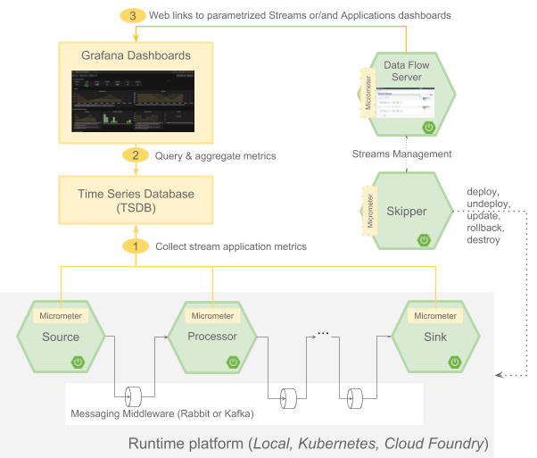
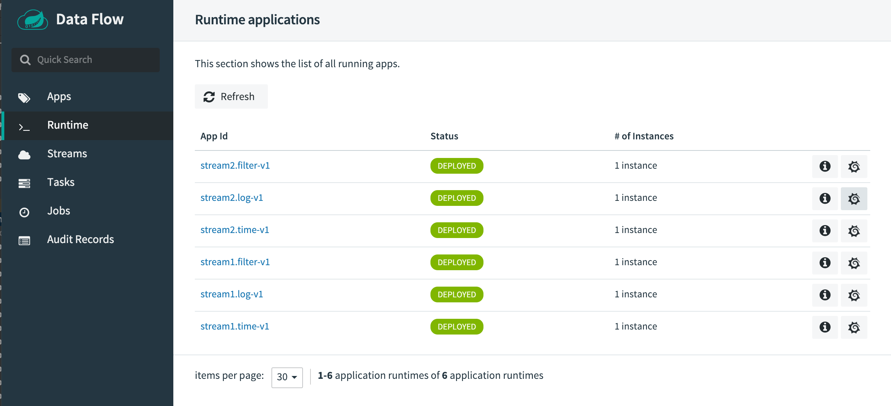
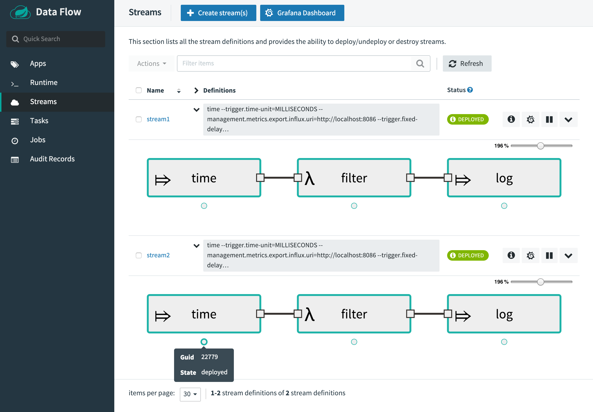

# Stream Monitoring with Prometheus and InfluxDB

This section describes how to monitor the applications that were deployed as part of a Stream. The setup for each platform is different but the general architecture is the same across the platforms.

The Data Flow 2.x metrics architecture is designed around the [Micrometer](https://micrometer.io/) library which is a Vendor-neutral application metrics facade. It provides a simple facade over the instrumentation clients for the most popular monitoring systems. See the [Micrometer documentation](https://micrometer.io/docs) for the list of supported monitoring systems. Starting with Spring Boot 2.0, Micrometer is the instrumentation library powering the delivery of application metrics from Spring Boot. Spring Integration provides [additional integration](https://docs.spring.io/spring-integration/docs/current/reference/html/#micrometer-integration) to expose metrics around message rates and errors which is critical to the monitoring of deployed Streams.

All the Spring Cloud Stream App Starters are configured to support two of the most popular monitoring systems, Prometheus and InfluxDB. You can declaratively select which monitoring system to use. If you are not using Prometheus or InfluxDB, you can customize the App starters to use a different monitoring system as well as include your preferred micrometer monitoring system library in your own custom applications. To help you get started monitoring Streams, Data Flow provides [Grafana](https://grafana.com/) Dashboards you can install and customize for your needs.

The general architecture of how applications are monitored is shown below.



To allow aggregating metrics per application type, per instance or per stream the [Spring Cloud Stream Application Starters](http://docs.spring.io/spring-cloud-dataflow/docs/current/reference/htmlsingle/#applications) are configured to use the following Micrometer tags:

| Tag Name          | Description                                                                   |
| ----------------- | ----------------------------------------------------------------------------- |
| stream.name       | Name of the Stream that contains the applications sending the metrics         |
| application.name  | Name or label of the application reporting the metrics                        |
| application.type  | The type (Source, Processor or SInk) of the application reporting the metrics |
| application.guid  | Unique instance identifier of the application instance reporting the metrics  |
| application.index | application instance id (when available)                                      |

If the Data Flow server is started with the spring.cloud.dataflow.grafana-info.url property pointing to your Grafana URL, then the Grafana feature is enabled and Data Flow UI will provide you with Grafana-buttons that can open particular dashboard for given stream, application or application instance. Following screenshot illustrates these buttons:





As setting up Prometheus and InfluxDB is different depending on the platform you are running on, we provide instructions for each platform. In Spring Cloud Data Flow 2.x, local server and Kubernetes instructions have been provided.

## Local

### Prometheus

Prometheus is a popular pull based time series database that pulls the metrics from the target applications from preconfigured endpoints. Prometheus needs to be regularly provided with the URLs of the target applications to monitor. This task is delegated to a component called Service Discovery, which usually a platform specific implementation. The Data Flow server provides a standalone Service Discovery service that uses the Data Flow /runtime/apps REST endpoint to compute the URL locations of the deployed application’s Prometheus endpoints.

To enable Micrometer’s Prometheus meter registry for Spring Cloud Stream application starters, set the following properties.

```bash
management.metrics.export.prometheus.enabled=true
management.endpoints.web.exposure.include=prometheus
```

Disable the application’s security which allows for a simple Prometheus configuration to scrape monitoring information by setting the following property.

```bash
spring.cloud.streamapp.security.enabled=false
```

The following steps will start up Prometheus, Grafana, and the local service discovery application.

Clone the Data Flow github repository for tagged release and change to the prometheus/docker folder:

```bash
cd ./src/grafana/prometheus/docker
```

Set the SCDF_HOST_IP environment variable to the IP address of your local host. Use the real IP address and not the localhost/127.0.0.1. You can use ifconfig to find out your IP address.

```bash
export SCDF_HOST_IP=<YOUR locahost IP address>
```

In many cases the provided find_host_ip.sh script will give you the IP address.

```bash
source ./find_host_ip.sh
```

Start Prometheus, Grafana + Service-Discovery using docker-compose.

```bash
docker-compose up -d --build
```

Check the containers have started:

```bash
docker ps
CONTAINER ID IMAGE              ...  PORTS                    NAMES
2b8b6a442365 tzolov/spring-...  ...  0.0.0.0:8181->8181/tcp   service-discovery
bff63c4902d5 docker_prometheus  ...  0.0.0.0:9090->9090/tcp   prometheus
40190da6aa4b docker_grafana     .... 0.0.0.0:3000->3000/tcp   grafana
```

To validate the setup, you can login into those containers using the following commands.

```bash
docker exec -it service-discovery /bin/sh
docker exec -it prometheus /bin/sh
docker exec -it grafana /bin/bash
```

Then on the prometheus and service-discovery containers you can check the content of the targets.json file like this: cat /tmp/scdf-targets/targets.json

You can reach the Prometheus UI on http://localhost:9090/graph and http://localhost:9090/targets

The Grafana dashboard can be reached at http://localhost:3000 with credentials user: admin, password: admin. It comes with two provisioned dashboards

1. Streams: http://localhost:3000/d/scdf-streams/streams?refresh=10s

1. Applications: http://localhost:3000/d/scdf-applications/applications?refresh=10s

Start the Skipper server. Then start the Data Flow server with the following properties:

```bash
--spring.cloud.dataflow.applicationProperties.stream.management.metrics.export.prometheus.enabled=true
--spring.cloud.dataflow.applicationProperties.stream.spring.cloud.streamapp.security.enabled=false
--spring.cloud.dataflow.applicationProperties.stream.management.endpoints.web.exposure.include=prometheus,info,health
--spring.cloud.dataflow.grafana-info.url=http://localhost:3000
```

Now if you deploy a simple stream that uses Kafka, such as

```bash
dataflow:>app import --uri http://bit.ly/Einstein-SR2-stream-applications-kafka-maven --force
dataflow:>stream create stream2 --definition "time --fixed-delay=10 --time-unit=MILLISECONDS | filter --expression=payload.contains('3') | log" --deploy
```

You should see dashboards similar to these.


You can destroy all containers with

```bash
docker-compose down
```

### InfluxDB

<!--NOTE-->

By default the Data Flow docker-compose configures Stream monitoring with InfluxDB and pre-built dashboards for Grafana. The follow instructions are provided to let you configure InfluxDB and Grafana in case you decide to install Data Flow manually, without the the help of the getting started docker-compose.

<!--END_NOTE-->

InfluxDB is a popular open-source push based time series database. It supports downsampling, automatically expiring and deleting unwanted data, as well as backup and restore. Analysis of data is done via a SQL-like query language.

To enable Micrometer’s Influx meter registry for Spring Cloud Stream application starters, set the following property.

```bash
management.metrics.export.influx.enabled=true
```

In the docker setup provided below the InfluxDB server runs on localhost:8086. If you use a different InfluxDB server, setting Common Application Properties for Influx is a convenient way to have all deployed applications configured to send metrics to Influx. The property to set is management.metrics.export.influx.uri. Alternatively you can pass this as a deployment property app.\*.management.metrics.export.influx.uri={influxdb-server-url} when deploying a stream. The Micrometer influx documentation shows the full list of Spring Boot properties to configure sending metrics to Influx.

The following steps will start up Influx and Grafana.

Clone the Data Flow github repository for tagged release and change to the influxdb/docker folder:

```bash
cd ./src/grafana/influxdb/docker
```

Start Influx and Grafna using docker-compose.

```bash
docker-compose up -d --build
```

Check the containers have started:

```bash
docker ps
CONTAINER ID        IMAGE               PORTS                    NAMES
1b7633c63ba1        docker_influxdb     0.0.0.0:8086->8086/tcp   influxdb
2f42e88f0606        docker_grafana      0.0.0.0:3000->3000/tcp   grafana
```

To validate the setup, you can login into those containers using the following commands.

```bash
docker exec -it influxdb /bin/sh
docker exec -it grafana /bin/bash
```

and check the content of InfluxDB

```bash
root:/# influx
> show databases
> use myinfluxdb
> show measurements
> select * from spring_integration_send limit 10
```

Grafana dashboard can be reached at http://localhost:3000 with credentials user: admin, password: admin. It comes with 2 provisioned dashboards.

1. Streams: http://localhost:3000/d/scdf-streams/streams?refresh=10s

1. Applications: http://localhost:3000/d/scdf-applications/applications?refresh=10s

Start the Skipper server. Then start the Data Flow server with the following properties:

```bash
--spring.cloud.dataflow.applicationProperties.stream.management.metrics.export.influx.enabled=true
--spring.cloud.dataflow.applicationProperties.stream.management.metrics.export.influx.db=myinfluxdb
--spring.cloud.dataflow.applicationProperties.stream.management.metrics.export.influx.uri=http://localhost:8086
--spring.cloud.dataflow.grafana-info.url=http://localhost:3000
```

Now if you deploy a simple stream that uses Kafka, such as

```bash
dataflow:>app import --uri http://bit.ly/Einstein-SR2-stream-applications-kafka-maven --force

dataflow:>stream create stream2 --definition "time --fixed-delay=10 --time-unit=MILLISECONDS | filter --expression=payload.contains('3') | log" --deploy
```

You should see dashboards similar to these.


## Kubernetes

### Prometheus

Prometheus is a popular pull based time series database that pulls metrics from the target applications from a pre-configured endpoint. When running in Kubernetes, Prometheus will "scrape" metrics from target applications that have specific pod level annotation. The endpoint to scrape is provided by Spring Boot, under the default path of `/actuator/prometheus`.

Out of the box, each binder middleware configuration file defines attributes to enable metrics and supporting properties. Settings for RabbitMQ can be found in: `src/kubernetes/server/server-config-rabbit.yaml` and `src/kubernetes/server/server-config-kafka.yaml` for Kafka. The main point of interest is the following configuration section:

```yaml
applicationProperties:
  stream:
    management:
      metrics:
        export:
          prometheus:
            enabled: true
      endpoints:
        web:
          exposure:
            include: 'prometheus,info,health'
    spring:
      cloud:
        streamapp:
          security:
            enabled: false
grafana-info:
  url: 'http://grafana:3000'
```

In this configuration, Prometheus metrics are enabled along with the appropriate endpoints and security settings.

With Prometheus, Grafana, Spring Cloud Data Flow and any other services as defined in the [Getting Started - Kubernetes](%currentPath%/installation/kubernetes) section up and running, metrics are ready to be collected.

<!--WARNING-->

The address used to accesss the Grafana UI will be dependent on the Kubernetes platform the system is deployed to. If you are using for example GKE, the LoadBalancer address would be used. If using Minikube which does not provide a LoadBalancer implementation, the IP of Minikube along with an assigned port is used. In the following examples, for simplicity we will use Minikube.

<!--END_WARNING-->

To obtain the URL of the Grafana UI when deployed to Minikube, run the following command:

```bash
$ minikube service --url grafana
http://192.168.99.100:31595
```

In the above example, the Grafana dashboard can be reached at http://192.168.99.100:31595. The default credentials are username: admin and password: password. The Grafana instance is pre-provisioned with two dashboards:

1. Streams: http://192.168.99.100:31595/d/scdf-streams/streams?refresh=10s

1. Applications: http://192.168.99.100:31595/d/scdf-applications/applications?refresh=10s

Metrics can be collected on a per application / stream basis, or applied to all deployed applications globally.

To deploy a single stream with metrics enabled, the following can be entered into the Spring Cloud Data Flow shell:

```bash
dataflow:>stream create metricstest --definition "time --fixed-delay=10 --time-unit=MILLISECONDS | filter --expression=payload.contains('3') | log"
dataflow:>stream deploy --name metricstest --properties "deployer.*.kubernetes.podAnnotations=prometheus.io/path:/actuator/prometheus,prometheus.io/port:8080,prometheus.io/scrape:true"
```

The above example creates a stream definition along with setting the podAnnotations property on to each application in the stream. The annotations applied to the pod indicate to Prometheus that it should be scraped for metrics by using the provided endpoint path and the port.

As a global setting, to deploy all streams with metrics enabled, the following podAnnotations entry would be appended to the configuration in either `src/kubernetes/skipper/skipper-config-rabbit.yaml` when using RabbitMQ or `src/kubernetes/skipper/skipper-config-kafka.yaml` when using Kafka:

```yaml
data:
  application.yaml: |-
    spring:
      cloud:
        skipper:
          server:
            platform:
              kubernetes:
                accounts:
                  myaccountname:
                    podAnnotations: 'prometheus.io/path:/actuator/prometheus,prometheus.io/port:8080,prometheus.io/scrape:true'
```

All streams and containing applicatons would then have the appropriate pod annotations applied instructing Prometheus to scrape metrics. The shell command to deploy the same stream from above, for example becomes:

```bash
dataflow:>stream create metricstest --definition "time --fixed-delay=10 --time-unit=MILLISECONDS | filter --expression=payload.contains('3') | log" --deploy
```

Either way metrics are enabled, after deploying a stream, visit the Grafana UI and you should see dashboard graphs similar to the image below:


